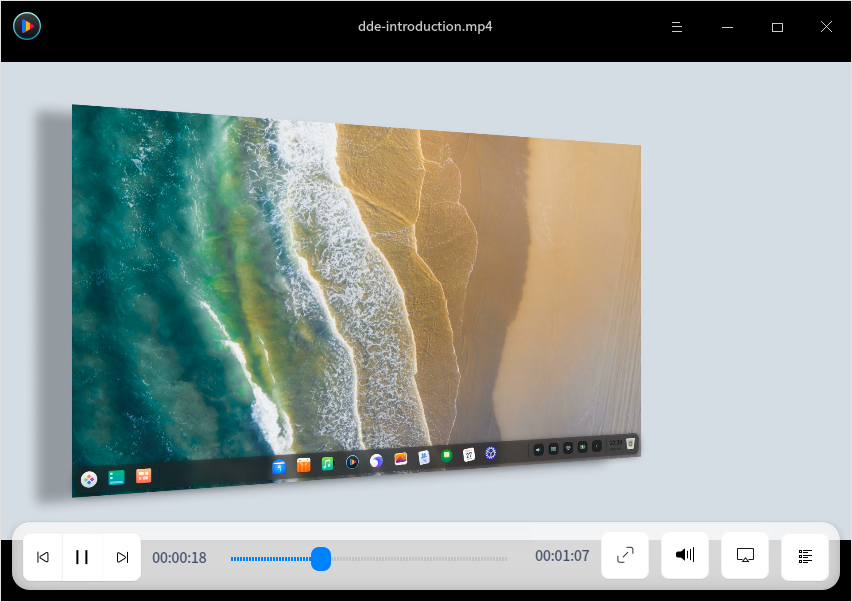

# Movie|../common/deepin_movie_96.svg|

## Overview

Movie shares a pleasant leisure time with you! Movie is a video player which supports many video formats with various features. With its simple interface and rich shortcuts, you can fulfill all operations with just one keyboard, saying farewell to your mouse in an easy way. 

## Guide

### Run Movie

1. Run  in the dock to enter the Launcher interface.
2. Locate  by scrolling the mouse wheel or searching "movie" in the Launcher interface and click it to run.
3. Right-click  and you can:
 - Click **Send to desktop** to create a desktop shortcut.
 - Click **Send to dock** to fix it in the Dock.
 - Click **Add to startup** to add it to startup and it will automatically run when the system starts up.

### Exit Movie
- On the Movie interface, click  to exit.
- Right-click  in the Dock and select **Close All** to exit.
- Click  on the Movie interface and select **Exit** to exit.

### View Shortcuts

On the Movie interface, press **Ctrl + Shift + ?** to view shortcuts. Proficiency in shortcuts will greatly improve your efficiency.

>  Tips: You can view the shortcuts any time during your video playback.

## Main Interface

Immerse yourself in the pure joy of wonderful videos through frequently used functions!

| Number | Name           | Description                                                  |
| ------ | -------------- | ------------------------------------------------------------ |
| 1      | Play window    | Display the video content. The video information and function icons will display after the mouse pointer is moved into the play window. Otherwise, they will be hidden. The play window is frameless. You can freely drag the play window to manually adjust its size. |
| 2      | Time display   | Display the total time and played time of the current video. |
| 3      | Preview window | Display the video preview. You can view the video content at a time point via the preview window. |
| 4      | Progress bar   | Display the play progress. Drag the progress bar to adjust your play progress. The video preview window will display when the mouse pointer is placed over the progress bar. |
| 5      | Video title    | Display the name of video which is now playing.              |
| 6      | Main menu    | You can open files/folders, switch window themes, view help manual, and get more information about Movie. |

&nbsp;&nbsp;&nbsp;&nbsp;&nbsp;&nbsp;&nbsp;&nbsp;&nbsp;&nbsp;&nbsp;&nbsp;&nbsp;
>  Notes: The preview window will display by default when the mouse is placed over the progress bar. If you do not need to display the preview window, you can enter the settings and change accordingly. Please refer to the [Basic Settings](#Basic Settings) for details.

### Icon Description

| Icon                                                       | Name       | Icon                                                       | Name            |
| ---------------------------------------------------------- | ---------- | ---------------------------------------------------------- | --------------- |
|      | Previous   |      | Next            |
|      | Play       |   | Pause           |
|     | Fullscreen |  | Exit fullscreen |
|  | Playlist   |     | Volume          |

## Basic Operations

### Play Films

You can play films in the following ways:
- When there are no files in the playlist, click or  and open the File Manager to select a film file.
- On the Movie interface, right-click or click  to select **Open file** and open the File Manager to select a film file.
- On the Movie interface, right-click or click  to select **Open folder**. All the audiovisual files in the folder are displayed in the playlist and will be played in turn. 
- On the Movie interface, right-click, select **Open URL**, and paste the online address to play the film.
- On the Movie interface, right-click and select **Open CD/DVD** to play the films in CD/DVD.
- Drag the file/folder directly to the Movie interface to play local films.

>  Notes: If you are using a computer equipped with a touchscreen, you can use touchscreen gestures to operate instead of the mouse. Hold down the film file with one finger and drag it to the Movie interface to play the film.

>  Attention: Make sure your network is well connected before playing online videos with Movie.

### Forward/Rewind

1. On the Movie interface, drag the control bar to forward or rewind the film.
2. On the Movie interface, pressor  on the keyboard to fast rewind the film.

> Notes: If you are using a computer equipped with a touchscreen, slide leftward with one finger on the video picture area to rewind and rightward to forward in fullscreen mode.

### Adjust Window

You can adjust the window size as you wish during playback.

Right-click on the Movie interface and you can:
- Select **Fullscreen** to play in fullscreen.
- Select **Mini Mode** to play in mini mode.
- Select **Always on Top** to put the window on the top layer.
- You can also drag the window edge to adjust the window size.

> Notes: Double-click the window to switch between **Fullscreen** and **Normal Window**.

### Adjust Play Mode

1. Right-click on the Movie interface.
2. Select **Play Mode** and you can:
 - Select **Order Play** and the films in the playlist will be played in order until the last one.
 - Select **Shuffle Play** and films in the playlist will be played randomly. Loop shuffle play mode will continue after playing all the files in the playlist.
 - Select **Single Play** and the player will stop after playing the current film.
 - Select **Single Loop** and the film will be played over and over again.
 - Select **List Loop** and the whole playlist will be played over and over again in the current order.

### Adjust Playback Speed

1. Right-click on the Movie interface.
2. Select **Playback Speed** and select the corresponding playback speed as needed in the dropdown list.

>  Tips: You can also use shortcuts to adjust the playback speed. Speed up/down is relative to the original play speed. The video playback speed increases/decreases by 0.1 times in default mode each time when it is sped up/down. The maximum playback speed is 2 times faster than the original speed and the minimum playback speed is 10 times slower than the original speed.
>
> - Press and hold **Ctrl **+  or  on the keyboard and the playback speed will increase or decrease.
> - Press to restore the original speed.

### Adjust Frame

1. Right-click on the Movie interface.
2. Select **Frame** and you can:
 - Adjust the film aspect ratio between 4:3, 16:9, 16:10, 1.85:1, and 2.35:1.
 - Rotate the film frame clockwise or counterclockwise.
 - Jump to previous frame or next frame.

### Set Sound
1. Right-click on the Movie interface.
2. Select **Sound** and you can:
 - Select **Channel** and select the channel on which the film is played.
 - Select **Track** and select the play track for the film.

>  Notes: If you are using a computer equipped with a touchscreen, slide upward with one finger on the video picture area to increase the volume and downward to decrease the volume in fullscreen mode.

### Set Subtitle
1. Right-click on the Movie interface.
2. Select **Subtitle** and you can:
 - Select **Load** to manually load subtitles.
 - Select **Online Search** to search subtitles online for the film and load the subtitles automatically after a successful match.
 - Check **Select** to switch between multiple subtitles for the film.
 - Select **Hide** to hide the current film subtitle.
 - Select **Encodings** to select an encoding for the film to solve the issue of garbled subtitles in some cases.

### Take Screenshots
1. Right-click on the Movie interface.
2. Select **Screenshot** and you can:
 - Select **Film Screenshot** to take a screenshot of the film in the current frame.
 - Select **Burst Shooting** to take 15 screenshots of the film at different times to form a preview image of the storyline.
 - Select **Open screenshot folder** to view the screenshots.

### View Film Info

1. Right-click on the Movie interface.
2. Select **Film Info** and you can view the film info, codec info, and audio info of the film. 

## Playlist Management

You can enter the playlist to add or delete the video files.

### Delete Film from the Playlist

1. Click  on the Movie interface.
2. Hover mouse pointer over the video file, right-click, and select **Delete from playlist**.

>  Tips: On the Playlist interface, hover mouse pointer over the video file and click  to delete it.

### Clear Playlist

1. Click  on the Movie interface.
2. Click the **Empty** icon under Playlist, or right-click the video file and select **Empty playlist**.

### Display in File Manager

1. Click  on the Movie interface.
2. Hover the mouse pointer over the video file, right-click, and select **Display in File Manager** to show the film file in File Manager.

## Main Menu

On the main menu, you can open files/folders, switch window themes, view help manual, and get more information about Movie.
### Settings

You can set the basic information, shortcut keys, and subtitles.

#### Basic Settings

1. Right-click or click  on the Movie interface.
2. Click **Settings** > **Basic**.
3. In the option **Play**, you can:
   - Check the **Clear playlist when exit** box to clear the playlist when you exit Movie.
   - Check the **Remember playback position** box to resume the film automatically from the last position played when Movie runs.
   - Check the **Auto add similar files to play **box to add the similar film files in the same folder to the playlist for playback in order.
   - Check the **Show video preview on mouseover** box to show the film preview when you move the mouse over progress bar.
   - Check the **Show thumbnails in progress bar** and a preview window will be displayed when you move the mouse over progress bar.

   > Notes: This feature is only available on X86 platform. 

   - Check the **Pause when minimized** to pause the playback automatically when minimizing the Movie window.
   - Select one mode from the **Default play mode** dropdown list and Movie will run in such mode next time.
4.  Under the **Screenshot** option, you can select the path to save screenshots as you wish.

#### Shortcuts Settings

1. Right-click or click  on the Movie interface.
2. Select **Settings** > **Shortcuts**.
3. You can select and input new shortcuts.

#### Subtitle Settings

1. Right-click or click  on the Movie interface.
2. Select **Settings** > **Subtitle**.
3. You can set the font and font size for subtitles.
>   Attention: Click **Restore Defaults** on the interface to restore all settings.

### Theme

The window theme provides three theme types, namely Light Theme, Dark Theme, and System Theme.

1. On the Movie interface, click .
2. Click **Theme** to select one theme.

### Help

1. On the Movie interface, click .
2. Select **Help** to view the manual of Movie.

### About

1. On the Movie interface, click .
2. Click **About** to view the version and introduction of Movie.

### Exit

1. On the Movie interface, click .
2. Click **Exit** to exit Movie.