# 電影|deepin-movie|

## 概述

電影是一款界面簡潔，性能流暢的影片播放軟件，兼容多種影片格式，支持播放本地影片或流媒體文件、在線查找字幕或手動加載字幕等功能。

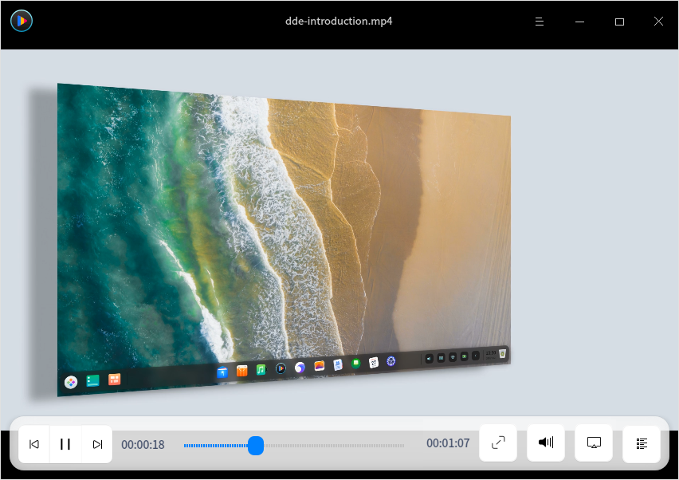

## 使用入門

### 運行電影

1. 單擊任務欄上的啟動器圖標 ，進入啟動器界面。
2. 上下滾動鼠標滾輪瀏覽或通過搜索，找到電影圖標 ，單擊運行。
3. 右鍵單擊 ，您可以：
 - 單擊 **傳送到桌面**，在桌面創建快捷方式。
 - 單擊 **傳送到任務欄**，將應用程序固定到任務欄。
 - 單擊 **加至開機啟動**，將應用程序添加到開機啟動項，在電腦開機時自動運行該應用。

### 關閉電影
- 在電影界面單擊 ，關閉電影。
- 在任務欄上右鍵單擊 ，選擇 **關閉所有**，關閉電影。
- 在電影界面單擊 ，選擇 **退出**，關閉電影。

### 查看快捷鍵

在電影界面，使用快捷鍵 **Ctrl + Shift + ?** 打開快捷鍵預覽界面。熟練地使用快捷鍵，將大大提升您的操作效率。

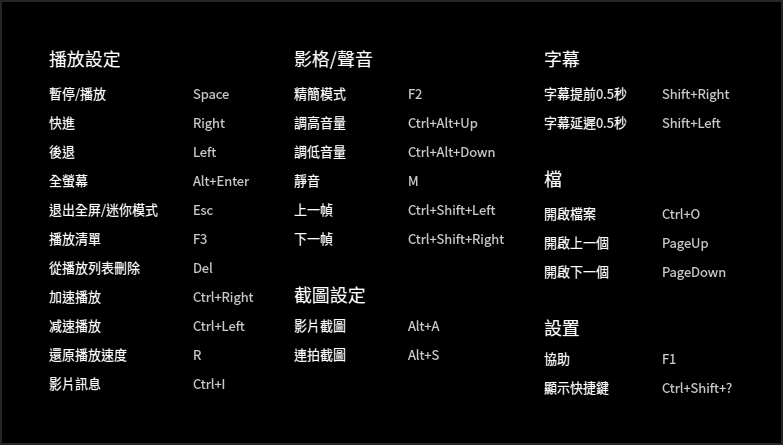

## 主界面

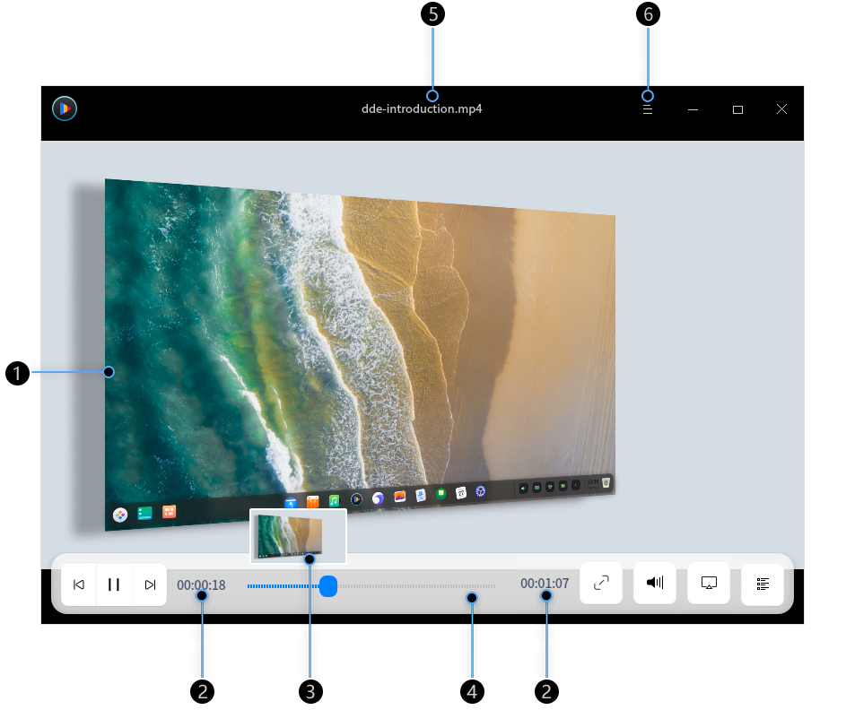

| 標號 | 名稱     | 說明                                                         |
| ---- | -------- | ------------------------------------------------------------ |
| 1    | 播放窗口 | 顯示影片內容，當鼠標指針移入播放窗口時會顯示標題欄和工具欄，當鼠標移出播放窗口或無操作時將隱藏標題欄和工具欄。播放窗口為無框模式，您可以任意拖拽播放窗口，手動調節播放窗口的大小。 |
| 2    | 時間顯示 | 顯示當前播放影片的時間總長和已經播放的時間訊息。             |
| 3    |  預覽窗口  | 顯示影片內容，通過預覽窗口查看某一時間點的影片內容。     |
| 4    | 進度條   | 顯示影片播放進度，拖拽進度條可以改變影片播放進度。將鼠標指針置於進度條上，將顯示影片預覽窗口。 |
| 5    | 標題欄 | 顯示正在播放的影片名稱。                                     |
| 6    | 主菜單  | 通過主菜單可以添加影片、設置影片、切換窗口主題、查看幫助手冊和版本訊息等。                     |

> 說明 ：當鼠標置於進度條上時，默認顯示預覽窗口。若要關閉預覽窗口，請在設置中取消勾選 **鼠標懸停進度條時顯示預覽**。

### 工具欄介紹

| 圖標                                                       | 名稱              | 圖標                                                      | 名稱           |
| ---------------------------------------------------------- | ----------------- | --------------------------------------------------------- | -------------- |
|  | 播放上一個影片    |  | 播放下一個影片 |
|  | 開始播放影片      |  | 暫停播放影片   |
|  | 全螢幕播放          |  |  退出全螢幕      |
|  | 調節音量       ||呼出/隱藏播放列表|

## 操作介绍

您可以在影院中進行影片添加、刪除、訊息查看等操作。

>  說明：採用不同的解碼技術，其所支持的功能也會不同，請以實際界面為準。

### 添加影片

您可以通過以下方式來播放影片：
- 當播放列表沒有文件時，單擊  或  按鈕，打開文件管理器選擇影片文件。
- 單擊鼠標右鍵或從  選擇 **開啓檔案**， 選擇影片文件。
- 單擊鼠標右鍵或從  選擇 **開啓資料夾**，文件夾中的影音文件將全部顯示在播放列表中，並依次進行播放。
- 單擊鼠標右鍵，選擇 **打開網址**，輸入影片文件的網絡地址，播放影片。

   >  注意 ：使用電影播放網絡影片文件時，請確保您的電腦是連網狀態。

- 單擊鼠標右鍵，選擇 **播放光盤**，播放光盤中的影片。
- 直接拖拽文件或文件夾到影院界面上，來播放本地影片。
>  說明：當使用觸控屏電腦時，一指按住影片文件拖拽到電影界面來播放影片。

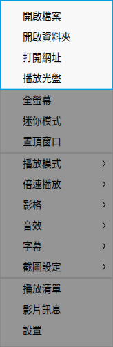

### 快進/快退

- 在電影界面，鼠標拖動進度條來快進或快退影片。
- 在電影界面，按下鍵盤上的  鍵快進影片或  鍵快退影片。
> 說明 ：當使用觸控屏電腦時，在全螢幕狀態下，一指向左滑動影片畫面區域快退影片，一指向右滑動影片畫面區域快進影片。

### 調整播放窗口
在播放影片時，您可以靈活的調整播放窗口大小。

在電影界面，單擊鼠標右鍵：
- 選擇 **全螢幕**，將播放窗口調整成全螢幕。
- 選擇 **迷你模式**，將播放窗口調整成迷你模式。
- 選擇 **置頂窗口**，將播放窗口置頂到桌面上方。
- 您也可以使用鼠標拖拽窗口邊緣，自由調整窗口大小。

>說明 ：在電影窗口上雙擊鼠標，在全螢幕與正常窗口之間切換。

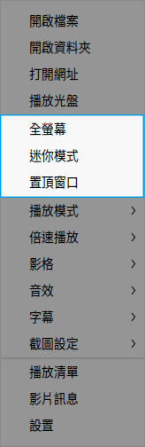

### 調整播放模式

1. 在電影界面，單擊鼠標右鍵。
2. 將鼠標移動到 **播放模式**，您可以：
 - 選擇 **順序播放**，將按照播放列表順序依次播放影片，播放列表中最後一個文件播放結束後停止。
 - 選擇 **隨機播放**，將隨機播放列表裏的文件，播放列表中的文件全部隨機播放一遍之後繼續循環隨機播放。
 - 選擇 **單個播放**，將當前影片播放完成後停止。
 - 選擇 **單個循環**，將循環播放當前影片。
 - 選擇 **列表循環**，將按照播放列表順序依次播放影片，播放列表中最後一個文件播放結束後重新播放第一個文件。

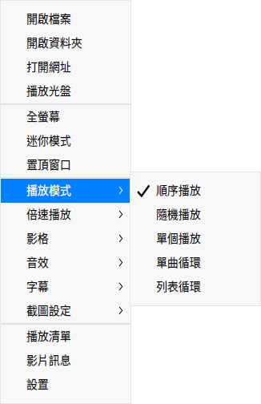

### 調整播放速度

1. 在影院界面，單擊鼠標右鍵。
2. 選擇 **倍速播放**，在下拉菜單中選擇播放速度。

> 竅門：您也可以使用快捷鍵來進行倍速播放，加速/ 減速播放是相對於原播放速度而言的，每加速/減速一次，影片播放速度默認增加/減少0.1 倍；最高播放速度為2倍的原播放速度，最低播放速度為0.1倍的原播放速度。
> - 按下鍵盤上的 **Ctrl** +  鍵，影片加速播放。
> - 按下鍵盤上的 **Ctrl** +  鍵，影片減速播放。
> - 按下鍵盤上的  鍵，恢復原速播放。

### 調整影格
1. 在電影界面，單擊鼠標右鍵。
2. 將鼠標移動到 **影格**，您可以：
 - 選擇一種影格比例，將播放畫面調整成相應的比例。
 - 選擇一種旋轉方式，將播放畫面相應旋轉。
 - 跳轉到上一幀/下一幀。

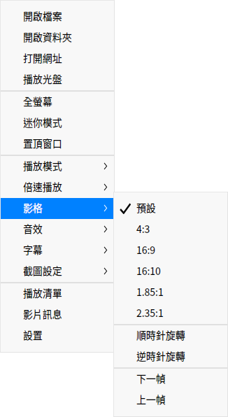

### 調整音效
1. 在電影界面，單擊鼠標右鍵。
2. 將鼠標移動到 **音效**，您可以：
 - 選擇 **聲道**，選擇影片的播放聲道。
 - 選擇 **音軌**，選擇影片的播放音軌。

>  說明：當使用觸控屏電腦時，在全螢幕狀態下，一指向上滑動影片畫面區域增加音量，一指向下滑動影片畫面區域減小音量。

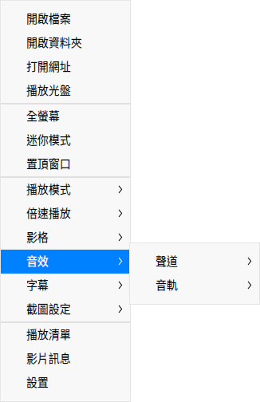

### 調整字幕
1. 在電影界面，單擊鼠標右鍵。
2. 將鼠標移動到 **字幕**，您可以：
 - 選擇 **載入字幕**，手動選擇字幕文件加入到影片中。
 - 選擇 **查找在線字幕**，影院將在線匹配字幕，匹配成功後自動載入。
 - 選擇 **選擇字幕**，在多個字幕間切換選擇。
 - 選擇 **隱藏字幕**，取消當前的字幕顯示。
 - 選擇 **編碼**，切換字幕的編碼方式，來解決某些情況下字幕顯示亂碼的問題。

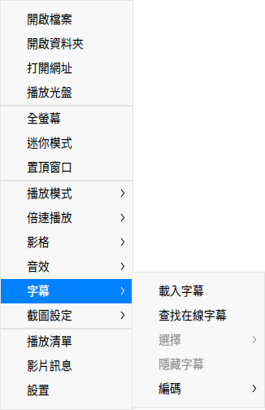

### 截圖
1. 在電影界面，單擊鼠標右鍵。
2. 將鼠標移動到 **截圖設定**，您可以：
 - 選擇 **影片截圖**，對當前畫面進行截圖。
 - 選擇 **連拍截圖**，分別截取影片不同時段的圖片，最後組成一張劇情連拍預覽圖。
 - 選擇 **前往截圖文件夾**，查看截圖。

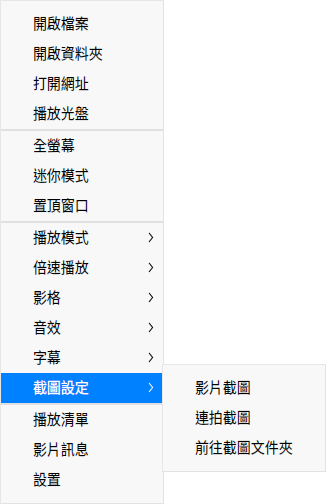

### 查看影片訊息

1. 在電影界面，單擊鼠標右鍵。
2. 選擇 **影片訊息**，可以查看影片的詳細訊息。

## 列表管理

您可以進入播放列表來添加或刪除影片文件。

### 刪除影片文件

1. 在電影界面，單擊 。
2. 進入播放列表窗口，右鍵單擊影片文件。
3. 選擇 **從播放列表刪除**。

> 竅門： 在播放列表界面，選擇一個影片文件，單擊按鈕  刪除該影片文件。

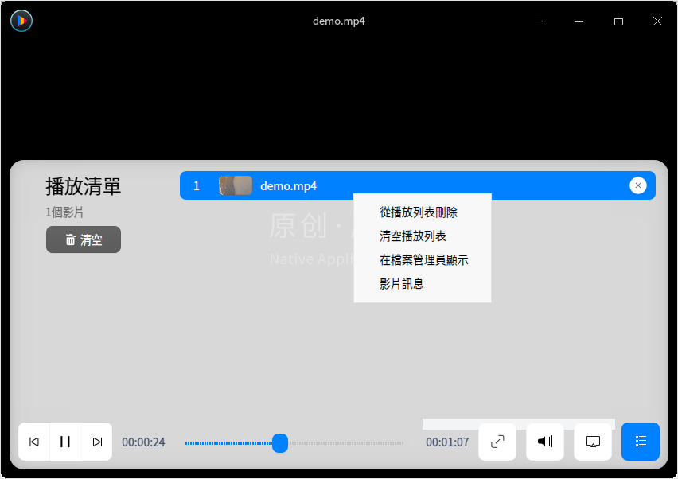

### 清空播放列表

1. 在電影界面，單擊 。
2. 進入播放列表窗口，右鍵單擊影片文件。
3. 選擇 **清空播放列表**。

### 在檔案管理員顯示

1. 在電影界面，單擊 。
2. 進入播放列表窗口，右鍵單擊影片文件。
3. 選擇 **在檔案管理員顯示**，打開影片所在的文件夾。

## 主菜單

在主菜單中，您可以開啟檔案/開啟資料夾、切換窗口主題、查看幫助手冊，了解電影的更多訊息。

### 設置

在電影界面，單擊 ，選擇 **設置** ，您可以進行基礎設置、快捷鍵設置和字幕設置。

#### 基礎設置

**播放設置**

- 勾選 **退出影院時清空播放列表**，退出影院後將播放列表全部清空。
- 勾選 **記錄播放時間**，在打開影院後自動接續上次關閉時的影片播放。
- 勾選 **自動查找相似文件連續播放**，將同一個文件夾下名稱相似的影片，自動添加到播放列表中依次進行播放。
- 勾選 **鼠標懸停進度條時顯示預覽**，當鼠標懸停在播放進度條上時顯示預覽窗口。
- 勾選 **進度條顯示為膠片樣式**，當鼠標滑動進度條時顯示膠片樣式。

   > 說明：僅x86平台支持膠片格式。

- 勾選 **最小化時暫停**，在影院最小化時自動暫停影片文件的播放。
- 設置默認播放模式，下次啟動影院時默認以該模式來播放。

**解碼方式**

- **自動選擇**：根據設備配置自動選擇最合適的解碼方式。
- **硬件解碼**：通過硬件解碼影片。
- **軟件解碼**：通過軟件解碼影片。
- **專業模式**：根據用户選擇去硬解碼視頻。
	- **渲染引擎**：內置播放引擎選項。
	- **輸出驅動**：視頻輸出驅動。
	- **解碼方式**：硬件解碼方式選項。

**截圖** 

設置保存影片截圖的存儲位置。

#### 快捷鍵設置

查看快捷鍵，支持自定義快捷鍵。

#### 字幕設置

設置字體樣式和字號大小。

### 主題

窗口主題包含淺色主題、深色主題和系統主題。

1. 在電影界面，單擊 。
2. 選擇 **主題**，選擇一種主題顏色。

### 幫助

查看幫助手冊，進一步了解和使用電影。

1. 在電影界面，單擊 。
2. 選擇 **幫助**。
3. 查看電影的幫助手冊。

### 關於

1. 在電影界面，單擊 。
2. 選擇 **關於**。
3. 查看電影的版本和介紹。

### 退出

1. 在電影界面，單擊 。
2. 選擇 **退出**。