# 電影|deepin-movie|

## 概述

電影是一款介面簡潔，性能流暢的影片播放軟體，相容多種影片格式，支援播放本機影片或流媒體檔案、線上尋找字幕或手動載入字幕等功能。

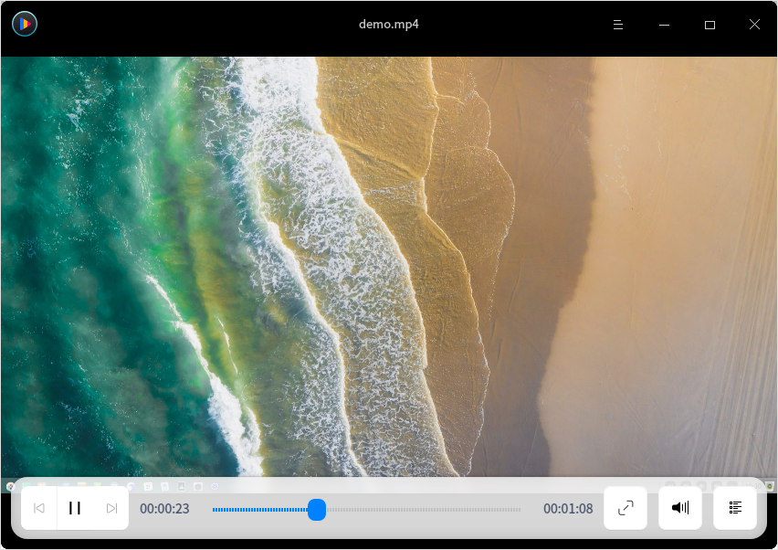

## 使用入門

### 執行電影

1. 單擊任務欄上的啟動器圖示 ，進入啟動器介面。
2. 上下滾動滑鼠滾輪瀏覽或透過搜尋，找到電影  單擊執行。
3. 右鍵單擊 ，您可以：
 - 單擊 **建立桌面捷徑**，在桌面建立捷徑。
 - 單擊 **釘選到Dock**，將應用程式固定到Dock。
 - 單擊 **開機啟動**，將應用程式添加到開機啟動項，在電腦開機時自動執行該應用。

### 關閉電影
- 在電影介面單擊  ，關閉電影。
- 在任務欄右鍵單擊 ，選擇 **全部關閉** 關閉電影。
- 在電影介面單擊 ，選擇 **退出** 關閉電影。

### 查看快捷鍵

在電影介面，使用快捷鍵 **Ctrl + Shift + ?** 打開快捷鍵預覽介面。打開快捷鍵預覽介面。

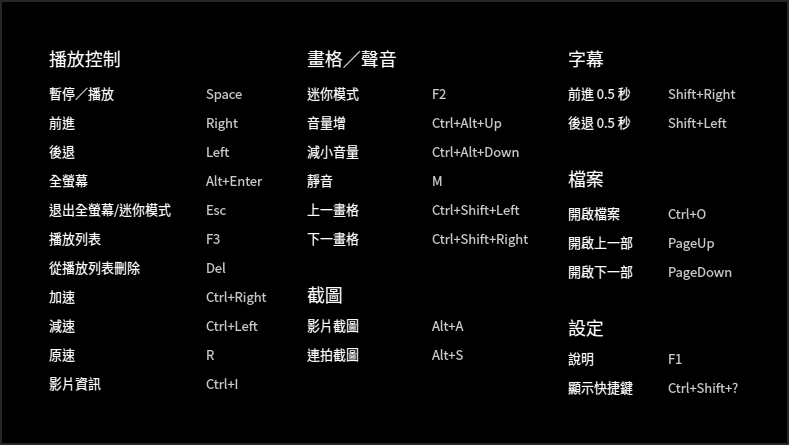

## 主介面

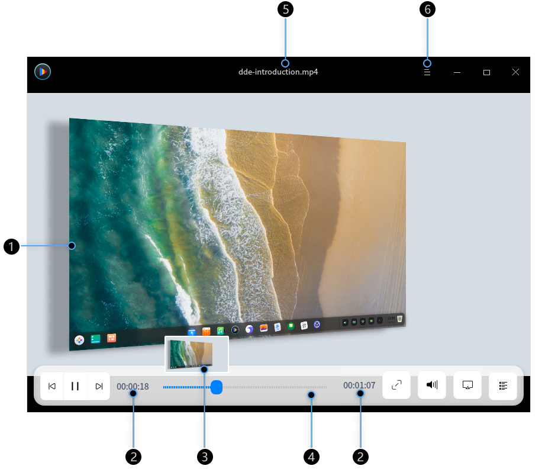

| 標號 | 名稱     | 說明                                                         |
| ---- | -------- | ------------------------------------------------------------ |
| 1    | 播放視窗 | 顯示影片內容，當滑鼠指標移入播放視窗後將顯示標題欄和工具列，當滑鼠移出播放視窗或無操作時將隱藏標題欄和工具列。播放視窗為無框模式，您可以任意拖曳播放視窗，手動調節播放視窗的大小。 |
| 2    | 時間顯示 | 顯示目前播放影片的時間總長和已經播放的時間訊息。             |
| 3    | 预览视窗 | 顯示影片內容，透過预览视窗查看某一時間點的影片內容。 |
| 4    | 進度條 | 顯示影片播放進度，拖曳進度條可以改變影片播放進度。將滑鼠游標置於進度條上，顯示影片預覽視窗。 |
| 5    | 標題欄 | 顯示正在播放的影片名稱。                                     |
| 6    | 主選單   | 透過主選單可添加影片、設定影片、切換視窗主題、查看說明手冊和版本訊息等。 |

> 說明：當滑鼠置於進度條上時，預設顯示預覽視窗。若要關閉預覽視窗，請在設定中取消勾選 **滑鼠放到進度條時顯示預覽圖**。

### 工具列介紹

| 圖示                                                  | 名稱              | 圖示                                                 | 名稱           |
| ----------------------------------------------------- | ----------------- | ---------------------------------------------------- | -------------- |
|  | 播放上一部影片 |  | 播放下一部影片 |
|  | 開始播放影片      |  | 暫停播放影片   |
|  | 全螢幕播放          |  | 退出全螢幕       |
|  | 調節音量 |    | 呼出/隱藏播放列表         |
|  | 投放畫面至其他裝置 |  |  |

## 操作介紹

您可以在影院中進行影片添加、刪除、訊息查看等操作。

>  說明：採用不同的解碼技術，其所支援的功能也會不同，請以實際介面為準。

### 添加影片

您可以透過以下方式播放影片：
- 當播放列表沒有檔案時，單擊 按鈕，打開檔案管理器選擇影片檔案。
- 單擊滑鼠右鍵或從選擇 **開啟檔案**，開啟檔案管理器選擇影片檔案。
- 單擊滑鼠右鍵或從選擇 **開啟資料夾**，資料夾中的影片檔案將全部顯示在播放列表中，並依次進行播放。
- 單擊滑鼠右鍵，選擇 **開啟網址**，輸入影片檔案的網路地址，播放影片。

>  注意：使用電影播放網路影片時，請確保您的電腦是連入網路的。

- 單擊滑鼠右鍵，選擇 **開啟CD/DVD**，播放光碟中的影片。
- 直接拖曳檔案或資料夾到電影介面上，來添加本機影片。

>   說明：當使用觸控屏電腦時，一指按住影片檔案拖曳到電影介面來播放影片。

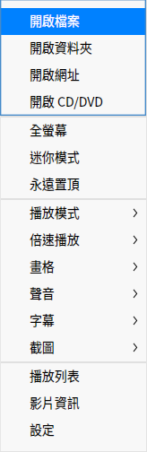

### 快進/快退

- 在電影介面，滑鼠拖動進度條快進或快退影片。

- 在電影介面，按下鍵盤上的  快進影片或  鍵快退影片。

   >  說明：當使用觸控屏電腦時，在全螢幕狀態下，一指向左滑動影片區域快退影片，一指向右滑動影片區域快進影片。 

### 調整播放視窗
在播放影片時，您可以靈活的調整播放視窗大小。

在電影介面上，單擊滑鼠右鍵：
- 選擇 **全螢幕**，將電影視窗調整成全螢幕。
- 選擇 **迷你模式**，將電影視窗調整成迷你模式。
- 選擇 **永遠置頂**，將電影視窗置頂到桌面上方，操作其他視窗時也不會遮擋電影視窗。
- 您也可以使用滑鼠拖曳視窗邊緣，自由調整視窗大小。

> 說明：在電影視窗上雙擊滑鼠，將在全螢幕與正常視窗之間切換。

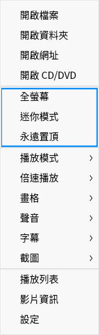

### 調整播放模式

1. 在電影介面上，單擊滑鼠右鍵。
2. 選擇 **播放模式**，在下拉選單中：
 - 選擇 **順序播放**，電影將按照播放列表順序依次播放影片，當列表中最後一個影片播放結束後停止。
 - 選擇 **隨機播放**，電影將隨機播放列表裡的影片，當全部影片隨機播放一遍之後繼續循環隨機播放。
 - 選擇 **單獨播放**，電影將目前影片播放完成後停止。
 - 選擇 **單獨循環**，電影將循環播放目前影片。
 - 選擇 **列表循環**，電影將按照播放列表順序依次播放影片，當列表中最後一個影片播放結束後重新播放第一個影片。

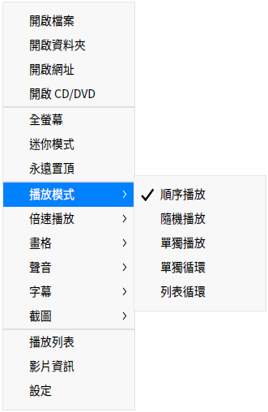

### 調整播放速度

1. 在電影介面上，單擊滑鼠右鍵。
2. 選擇 **倍速播放**，在下拉選單中選擇播放速度。

> 竅門：您也可以使用快捷鍵進行倍速播放，加速/ 減速播放是相對於原播放速度而言的，每加速/減速一次，影片播放速度預設增加/減少0.1 倍；最高播放速度為2倍的原播放速度，最低播放速度為0.1倍的原播放速度。
>
>- 按下鍵盤上的 **Ctrl** +  鍵，影片加速播放。
>- 按下鍵盤上的 **Ctrl** +  鍵，影片減速播放。
>- 按下鍵盤上的  鍵，復原原速播放。

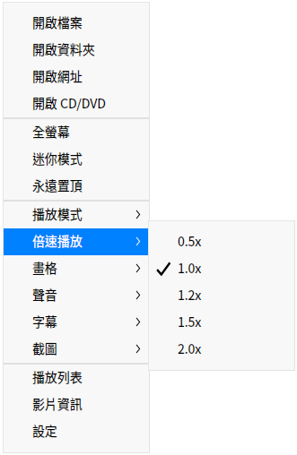

### 調整畫面

1. 在電影介面上，單擊滑鼠右鍵。
2. 選擇 **畫格**，在下拉選單中：
- 選擇畫面比例，將播放畫面調整成相應的比例。
- 選擇旋轉方式，將播放畫面順時針或逆時針旋轉。
- 選擇上一畫格/下一畫格。

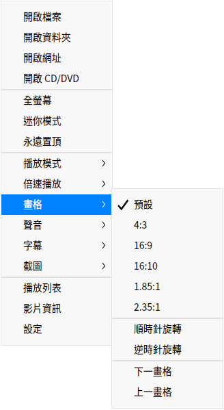

### 調整聲音
1. 在電影介面上，單擊滑鼠右鍵。
2. 選擇 **聲音**，在下拉選單中：
 - 選擇 **聲道**，選擇影片的播放聲道。
 - 選擇 **音軌**，選擇影片的播放音軌。

>  說明：當使用觸控屏電腦時，在全螢幕狀態下，一指向上滑動影片畫面區域增加音量，一指向下滑動影片畫面區域減小音量。

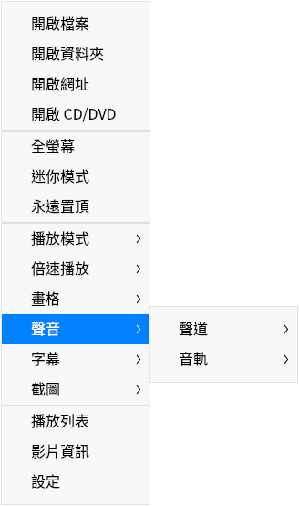

### 調整字幕
1. 在電影介面上，單擊滑鼠右鍵。
2. 選擇 **字幕**，在下拉選單中：
 - 選擇 **載入**，手動選擇字幕檔案加入到影片中。
 - 選擇 **線上搜尋**，電影將線上匹配字幕，匹配成功後自動載入。
 - 選擇 **選擇字幕**，在多個字幕間切換選擇。
 - 選擇 **隱藏字幕**，取消目前的字幕顯示。
 - 選擇 **編碼**，切換字幕的編碼方式，以解決某些情況下字幕顯示亂碼的問題。

### 截圖
1. 在電影介面上，單擊滑鼠右鍵。
2. 將滑鼠移動到 **截圖**，在下拉選單中：
 - 選擇 **影片截圖**，可以對目前畫面進行截圖。
 - 選擇 **連拍截圖**，可以分別截取影片不同時段的圖片，最後組成一張劇情連拍預覽圖。
 - 選擇 **前往截圖資料夾**，查看截圖。

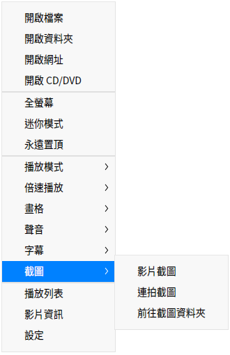

### 查看影片資訊

1. 在電影介面上，單擊滑鼠右鍵。
2. 選擇 **影片資訊**，可以查看影片的影片資訊、編碼訊息、音軌訊息。

### 影片投放

1. 在電影介面，單擊 。

2. 進入投放裝置選擇畫面，系統將自動搜尋與本裝置位於同一網路的可投放裝置。

3. 在搜尋結果頁面中，單擊要投放的裝置名稱即可開始投放。

4. 投放成功後，將會顯示投放畫面，單擊其中的結束投放按鈕即可停止投放。

## 列表管理

在播放列表中管理已添加的影片檔案。

### 刪除影片檔案

1. 在電影介面，單擊 。
2. 進入播放列表視窗，將滑鼠游標置於影片檔案上。
3. 右鍵單擊  **從播放列表刪除**。

>  竅門： 在播放列表介面，將滑鼠游標置於影片檔案上，單擊  刪除影片檔案。

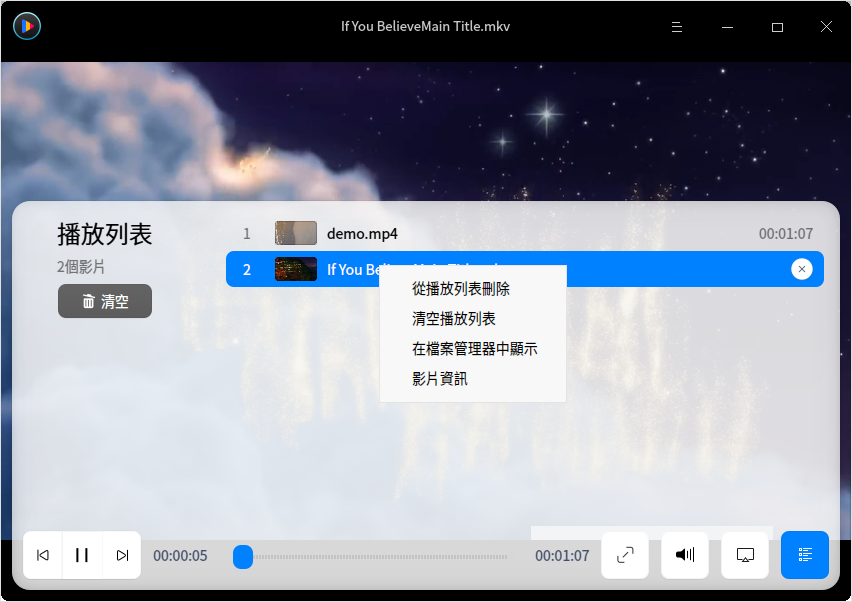

### 清空播放列表

1. 在電影介面，單擊 。
2. 進入播放列表視窗，右鍵單擊影片檔案。
3. 選擇 **清空播放列表** 或 直接單擊左側 **清空**。

### 在檔案管理器中顯示

1. 在電影介面，單擊 。
2. 進入播放列表視窗，右鍵單擊影片檔案。
3. 選擇 **在檔案管理器中顯示**，打開該影片檔案所在的資料夾。

## 主選單

在主選單中，您可以開啟檔案/開啟資料夾添加影片、設定影片播放、切換視窗主題、查看說明手冊、了解電影的更多訊息。

### 設定

在電影介面，單擊 ，選擇 **設定** ，您可以進行基本設定、快捷鍵設定和字幕設定。

#### 基本設定

**播放設定**

  - 勾選 **退出後清除播放列表** 複選框，退出電影後將播放列表完全部清空。
  - 勾選 **記住播放位置** 複選框，在開啟電影後自動接續上次關閉時的影片播放。
  - 勾選 **自動播放相似檔案** 複選框，將同一個資料夾下名稱相似的影片檔案自動添加到播放列表中依次進行播放。
  - 勾選 **滑鼠放到進度條時顯示預覽圖** 複選框，當滑鼠放到播放進度條上時顯示預覽圖。
  - 勾選 **進度條顯示為膠片樣式**，當滑鼠滑動進度條時顯示膠片樣式。
>  說明：僅x86平台支援膠片格式。

  - 勾選 **最小化時暫停** 複選框，在電影最小化時自動暫停影片檔案的播放。
  - 設定預設播放模式，在「預設播放模式」下拉框中選擇一個模式，下次啟動電影時預設以該模式播放。

**解碼方式**

- **自動選擇**：根據裝置配置自動選擇最合適的解碼方式。
- **硬體解碼**：透過硬體解碼影片。
- **軟體解碼**：透過軟體解碼影片。

**截圖** 

設定影片截圖儲存路徑。

#### 快捷鍵設定

查看快捷鍵，支援自訂快捷鍵。

#### 字幕設定

設定字型樣式和圖示大小。

### 主題

視窗主題包含亮色主題、暗色主題和系統主題。

1. 在電影介面，單擊 。
2. 單擊 **主題**，選擇一種主題顏色。

### 說明

查看說明手冊，進一步了解和使用電影。

1. 在電影介面，單擊  。
2. 選擇 **說明**。
3. 查看電影的說明手冊。

### 關於

1. 在電影介面，單擊  。
2. 選擇 **關於**。
3. 查看電影的版本和介紹。

### 退出

1. 在電影介面，單擊 。
2. 選擇 **退出**。
