# Deepin Movie |../common/deepin-movie.svg|
## Overview |../common/icon_overview.svg|

Deepin Movie is a video player with various features built in deepin. It offers simple interface and rich shortcuts, supports various video formats. You can also play online video resources, freely set the sound, frame and subtitle.

Deepin Movie, shares extreme play experience with you. Use it, you will love it!

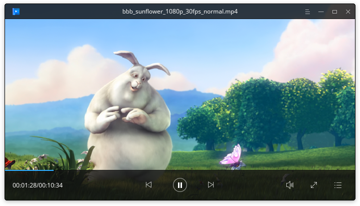

## Guide |../common/icon_guide.svg|

### Run Deepin Movie

1. On Dock, click on  to enter Launcher.
2. Right click on , you can:
  - Click on **Send to desktop** to create a desktop shortcut.
  - Click on **Send to dock** to fix its icon on Dock.
  - Click on **Add to startup** to add it to startup, it will auto run when system boots.

> : You can also right click on a video and select **Open with Deepin Movie** to run.

### Exit Deepin Movie

- On Deepin Movie interface, click on  to exit.
- Right click on  on Dock, select **Close All** to exit.
- Click on  and select **Exit** to exit.

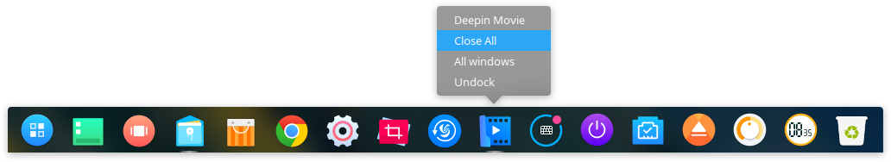

### View Shortcuts

1. On Deepin Movie Interface, press ++.
2. You can view all the shortcuts on the preview interface.

<table>
     <tr>
        <td colspan="2">PLAYBACK</td>
        <td colspan="2">FRAME/SOUND</td>
        <td colspan="2">SUBTITLE</td>
     </tr>
     <tr>
        <td>Pause/Play</td>
        <td>Space</td>
        <td>Mini mode</td>
        <td>F2</td>
        <td>0.5s forward</td>
        <td>Shift+Right</td>
     </tr>
     <tr>
        <td>Forward</td>
        <td>Right</td>
        <td>Volume up</td>
        <td>Up</td>
        <td>0.5s backward</td>
        <td>Shift+Left</td>
     </tr>
     <tr>
        <td>Rewind</td>
        <td>Left</td>
        <td>Volume down</td>
        <td>Down</td>
        <td>-</td>
        <td>-</td>
     </tr>
     <tr>
        <td>Fullscreen</td>
        <td>Return</td>
        <td>Mute</td>
        <td>M</td>
        <td>-</td>
        <td>-</td>
     </tr>
     <tr>
        <td>Playlist</td>
        <td>F3</td>
        <td colspan="2">FILE</td>
        <td colspan="2">SCREENSHOT</td>
     </tr>
     <tr>
        <td>Speed up</td>
        <td>Ctrl+right</td>
        <td>Open file</td>
        <td>Ctrl+O</td>
        <td>Film screenshot</td>
        <td>Alt+A</td>
     </tr>
     <tr>
        <td>Speed down</td>
        <td>Ctrl+left</td>
        <td>Open previous</td>
        <td>PgUp</td>
        <td>Burst screenshot</td>
        <td>Alt+S</td>
     </tr>
     <tr>
        <td>Reset speed</td>
        <td>R</td>
        <td>Open next</td>
        <td>PgDown</td>
        <td>-</td>
        <td>-</td>
     </tr>
</table>

## Main Interface|../common/icon_maininterface.svg|

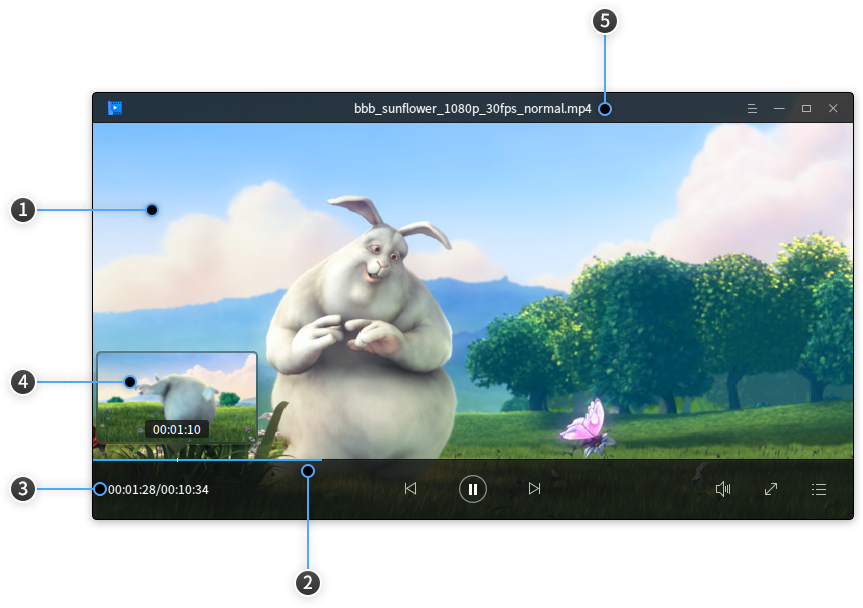

<table>
  <tr>
            <td>1</td>
            <td width="60px">Play window</td>
            <td>Display the film content, film information and function icons will be displayed after the mouse pointer moved into the play window, otherwise will be hidden. Play window is the frameless mode, you can freely drag and drop play window to manually adjust its size. </td>
        </tr>
        <tr>
            <td>2</td>
            <td>Progress bar</td>
            <td>It's to display film play progress and you can change the progress by dragging and dropping the progress bar. Move the mouse pointer over the progress bar, and the progress bar will be bold intelligently and display the film preview window. </td>
        </tr>
         <tr>
            <td>3</td>
            <td>Time display</td>
            <td>Display the total time and played time information of current film. </td>
        </tr>
         <tr>
            <td>4</td>
            <td>Preview window</td>
            <td>Display the film preview, you can view the video content at a point in time by the preview window. </td>
        </tr>
         <tr>
            <td>5</td>
            <td>Film title</td>
            <td>Display the film name. </td>
        </tr>
</table>

### Icon Description

<table>
     <tr>
       <td></td>
       <td>Main Menu</td>
       <td></td>
       <td>Minimize</td>
       <td></td>
       <td>Maximize</td>
       <td></td>
       <td>Close</td>
     </tr>
     <tr>
       <td></td>
       <td>Play</td>
       <td></td>
       <td>Pause</td>
       <td></td>
       <td>Play previous film</td>
       <td></td>
       <td>Play next film</td>
     </tr>
     <tr>
       <td></td>
       <td>Volume</td>
       <td></td>
       <td>Fullscreen</td>
       <td></td>
       <td>Playlist</td>
       <td></td>
       <td>Exit mini mode</td>
     </tr>
</table>

### Play Film

You can play film by the following ways:

1. On Deepin Movie interface, right click or click on  to select **Open File**.
2. On Deepin Movie interface, right click or click on  to select **Open Folder**.
3. On Deepin Movie interface, right click to select **Open URL**.
4. On Deepin Movie interface, right click to select **Open CD/DVD**.
5. Drag and drop file/folder to the main interface.

### Play/Pause

- On Deepin Movie interface, click on /.
- On Deepin Movie interface, press  on keyboard.
- On Deepin Movie interface, click the left mouse button.

>: Play and pause are mutually exclusive states.

### Previous/Next

- On Deepin Movie interface, press  / .
- On Deepin Movie interface, click on /.

### Forward/Rewind

1. On Deepin Movie interface, press  to forward the film.
2. Press  on keyboard to rewind the film.

### Speed Up/Down

1. On Deepin Movie interface, press + to speed up the film.
2. Press + to speed down the film
3. If you want to restore the original play speed, press  on keyboard.

>: Speed up/down is relative to the original play speed. Eevery pressing is 0.1 times. Maximum speed is 2 times of the original play speed and the minimum is 0.1 times.

## Basic operations|../common/icon_basicfuncton.svg|
On Deepin Movie interface, you can do many operations according to needs.

### Adjust Window

1. Right click on Deepin Movie interface.
2. Select **Fullscreen** to paly in fullscreen.
3. Select **Mini Mode** to play in mini mode.
4. Select **Always on Top** to put the window on top layer.

> : You can also drag and drop the window in equal proportion by needs.

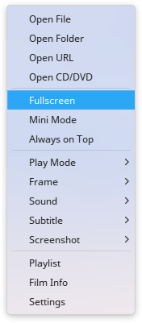

### Select Play Mode

1. Right click on Deepin Movie interface.
2. Select **Play Mode**, you can:
  - Check **Order Play**, films in playlist will be played orderly.
  - Check **Shuffle Play**, films in playlist will be played disorderly, but won't repeat a film over and over.
  - Check **Single Play**, the player will stop when the current film played.
  - Check **Single Loop**, the film will be played over and over.
  - Check ** List Loop**, the whole playlist will be played over and over.

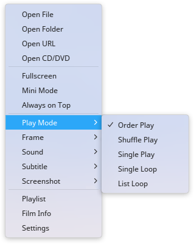

### Adjust Frame

1. Right click on Deepin Movie interface.
2. Select **Frame**, you can:
  - Adjust the flim aspect ratio between 4:3, 16:9, 16:10, 1.85:1 and 2.35:1.
  - Rotate the flim frame clockwise or counterclockwise.

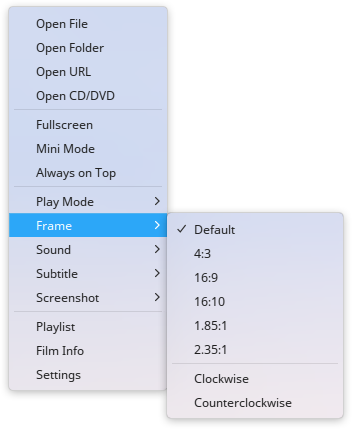

### Set Sound

1. Right click on Deepin Movie interface.
2. Select **Sound** > **Channel**, you can:
  - Check **Stereo**, the film will be played in stereo.
  - Check **Left channel**, the film will be played in left channel.
  - Check **Right channel**, the film will be played in right channel.
3. Select **Sound** > **track**, you can select to play the film in a track.

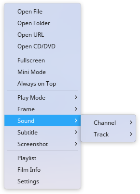

### Set Subtitle

1. Right click on Deepin Movie interface.
2. Select **Subtitle**, you can:
  - Check **Load**, to manually load subtitles.
  - Check **Online Search**, to search subtiles online for the film and auto load the subtitles.
  - Check **Select**, to select a subtitle for the film.
  - Check **Hide**, to hide the current film subtitle.
  - Check **Encodings**, to select an encoding for the film.

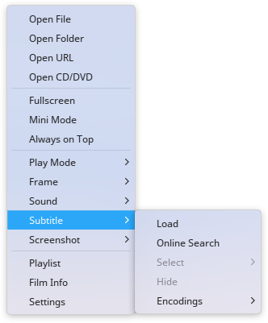

### Take a Screenshot

1. Right click on Deepin Movie interface.
2. Select **Screenshot**, you can:
  - Check **Film Screenshot**, to take a screenshot of the film in current frame.
  - Check **Burst Shooting**, to take 15 pictures of the film in different times.

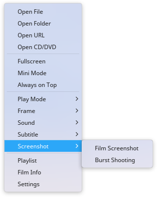

### View Film Info

1. Right click on Deepin Movie interface.
2. Select **Film Info**, you can view the file type, resolution, file size, duration and file path of the file.

> : You can also right click on playlist to select **Film Info** to view.

## Playlist Management|../common/icon_playlistsetting.svg|

### Show/Hide Playlist

1. Right click on Deepin Movie interface.
2. Check **Playlist** to show playlist and check again to hide playlist.

> : You can also click on  on the main interface to show/hide playlist.

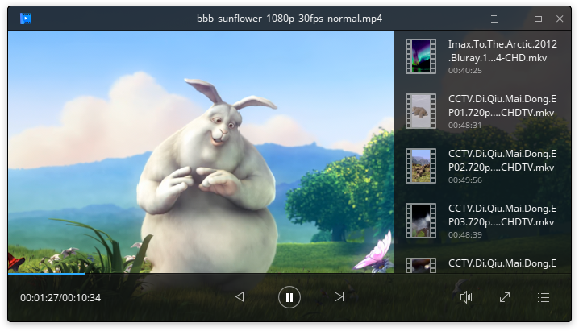

### Add Film to Playlist

You can add film to playlist by the following ways:
- Show the playlist, drag and drop file/folder to it.
- Right click on the main interface, and select **Open File/Open Folder/Open URL/Open CD/DVD** to add.
- Click on  on Deepin Movie interface, and select **Open File/Open Folder** to add.

### Delete Film from Playlist

1. On the playlist of Deepin Movie, hover on a film.
2. Click on the delete button on top right corner to delete file from playlist.

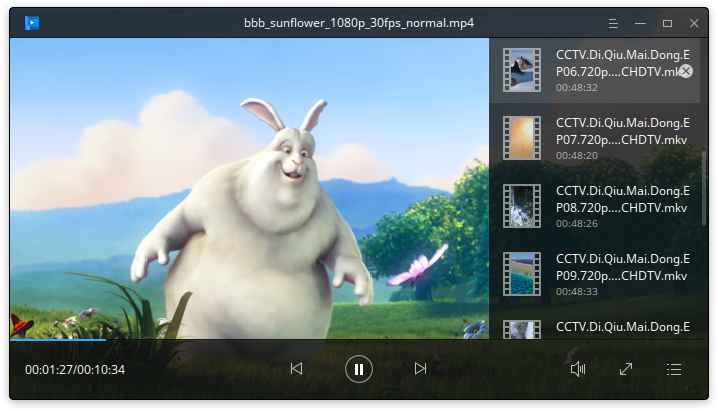

### Clear Playlist

1. Right click on the playlist.
2. Select **Clear playlist** to clear films from the playlist.

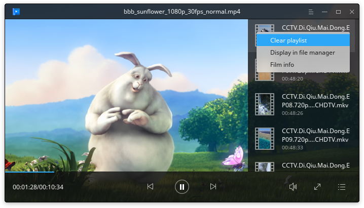

### Display in File Manager

1. Right click on the playlist.
2. Select **Display in file manager** to show the film file in file manager.

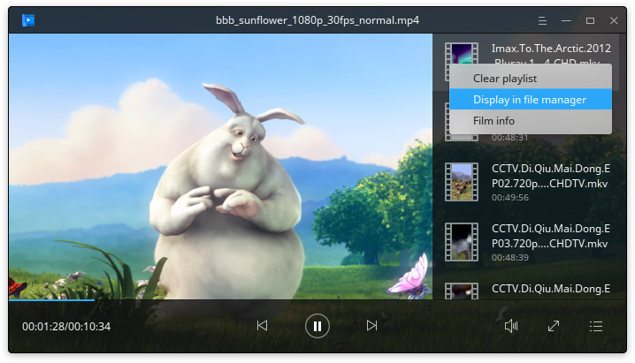

## Main Menu|../common/icon_optionsetting.svg|
### Basic Settings

1. On Deepin Movie interface, click on .
2. Select **Settings** > **Basic settings**.
3. In the option **Play**, you can:
 - Check the box of **Clear playlist when exit**, the playlist will be cleared when you exit Deepin Movie.
 - Check the box of **Remember playback position**, the film will be played automatically from last positon played when Deepin Movie runs.
 - Check the box of **Auto add similar files to play**,the related film files will be played one by one after the current film played.
 - Check the box of **Show video preview on mouseover**, the film preview will be shown when hovering on the progress bar.
 - Check the box of **Open a new player for each file played**, a new player will be opened when playing a film file.
 - Check the box of **Pause when minimized**, the film will be paused when minimizing Deepin Movie window.
4. In the option of **Screenshot**, you can select the path to save screenshot.

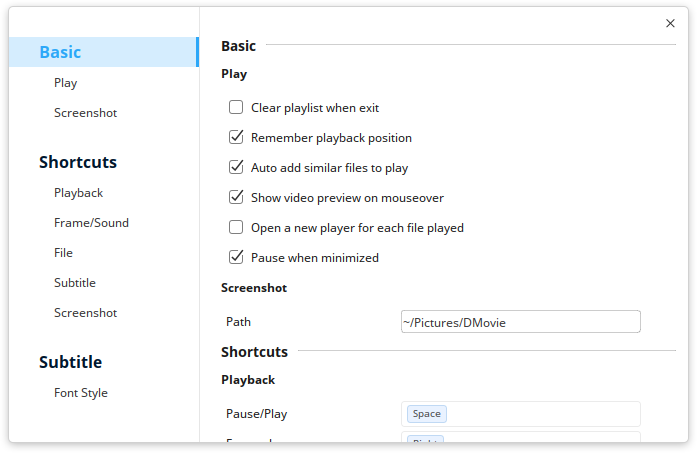

### Shortcuts Settings

1. On Deepin Movie interface, click on .
2. Select **Settings** > **Shortcuts**.
3. You can set the shortcuts for playback, frame/sound, file, subtitle and screenshot.

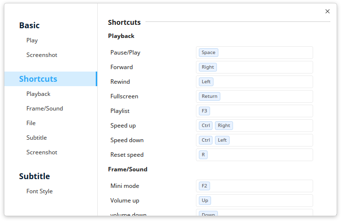

### Subtitle Settings

1. On Deepin Movie interface, click on .
2. Select **Settings** > **Subtitle**.
3. You can set the font and font size for subtitles.

> : You can also click on **Restore Defaults** to restore all settings.

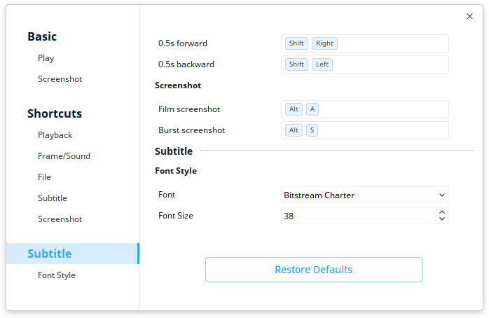

### Switch Theme

The theme of Deepin Movie is dark by default, you can click on **Light Theme** to swith.

1. On Deepin Movie interface, click on .
2. Select **Light Theme**.
3. The interface will switch to light theme.

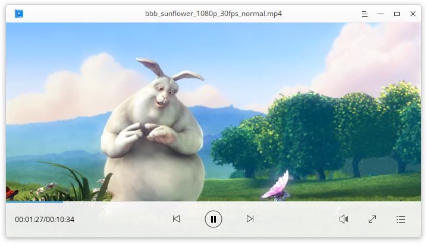

### Help

1. On Deepin Movie interface, click on .
2. Select **Help**.
3. View the manual.

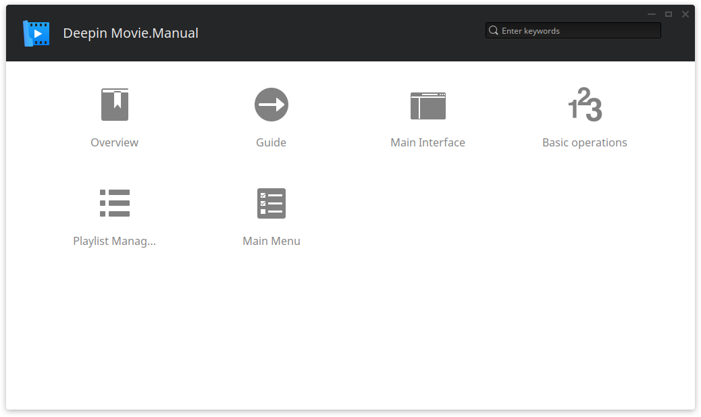

### About

1. On Deepin Movie interface, click on .
2. Select **About**.
3. View the version description.

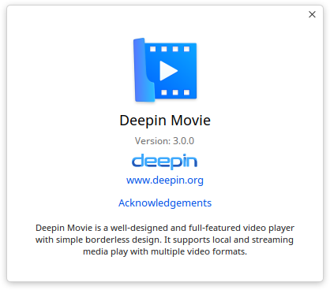

### Exit

1. On Deepin Movie interface, click on .
2. Click on **Exit** to exit.
